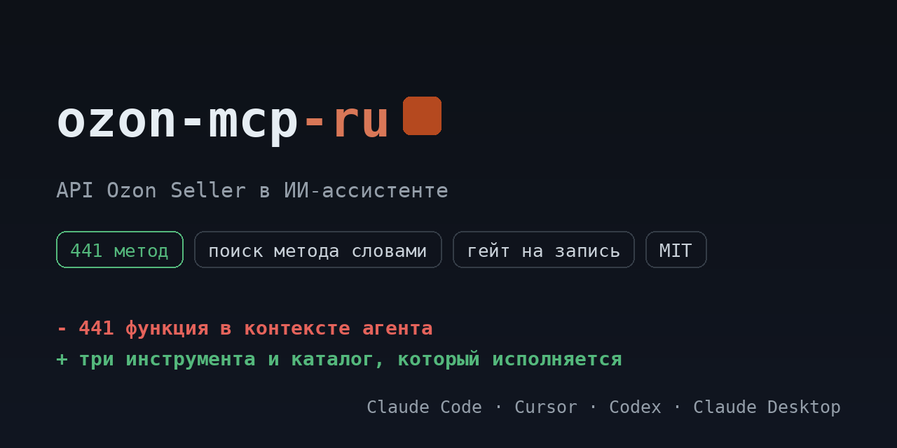

# ozon-mcp-ru

<!-- mcp-name: io.github.ilyautov/ozon-mcp-ru -->

API Ozon Seller для ИИ-ассистентов: товары, заказы FBS и FBO, цены, остатки, финансы, отзывы. Каталог исполняется сервером, у каждого метода класс доступа.

[](https://pypi.org/project/ozon-mcp-ru/)
[](https://github.com/ilyautov/ozon-mcp-ru/actions/workflows/ci.yml)
[](LICENSE)
[](#карта-методов)
[](https://marketplaces-mcp-ru.aifrontier.tech/ozon-api.html)
[](https://github.com/ilyautov/ozon-mcp-ru/stargazers)

<p align="center">
  <a href="https://marketplaces-mcp-ru.aifrontier.tech/ozon-api.html">
    
  </a>
</p>

Пакет поднимает один сервер, Ozon Seller, и ничего больше. Сервер, каталог и
ядро приходят зависимостью из [`marketplaces-mcp-ru`](https://github.com/ilyautov/marketplaces-mcp-ru):
здесь имя, точка входа и документация под один маркетплейс.

## Установка

Пакет на PyPI, поэтому строка одна:

```bash
uvx ozon-mcp-ru
```

Если нужна ветка `main`, а не релиз:

```bash
uvx --from git+https://github.com/ilyautov/ozon-mcp-ru ozon-mcp-ru
```

Claude Desktop, `claude_desktop_config.json`:

```json
{
  "mcpServers": {
    "ozon": {
      "command": "uvx",
      "args": ["ozon-mcp-ru"],
      "env": { "OZON_CLIENT_ID": "...", "OZON_API_KEY": "..." }
    }
  }
}
```

Третий путь, если агент умеет скиллы: он поставит сервер и настроит клиент сам.

```bash
npx skills add ilyautov/ozon-mcp-ru
```

## Ключи

**Seller API: Client-Id и Api-Key.** Зайдите в кабинет `seller.ozon.ru`, откройте **Настройки**, раздел **API-ключи**. Ozon выдаёт пару: `Client-Id` (число) и `Api-Key`. Оба уходят в заголовки одноимённых имён, хост запроса `api-seller.ozon.ru`.

**Performance API: client_id и client_secret.** Рекламный кабинет живёт отдельно и авторизуется по OAuth2: пара `client_id` и `client_secret` меняется на токен, хост `api-performance.ozon.ru`. Ключи Seller API там не работают, и наоборот.

**Куда положить, чтобы не хранить в открытую.** Сервер спросит ключи при первом запуске и положит их в `~/.marketplace-mcp/cabinets.json` с правами `chmod 600`. В репозиторий и в чат они не попадают. Магазинов можно подключить несколько и переключаться между ними прямо из чата.

| переменная | секрет | что это |
|---|---|---|
| `OZON_CLIENT_ID` | да | Client-Id из кабинета seller.ozon.ru, Настройки → API-ключи. |
| `OZON_API_KEY` | да | Api-Key из той же пары. Оба уходят в одноимённые заголовки. |

Ключи можно не держать в окружении: сервер умеет кабинеты и кладёт их в
`~/.marketplace-mcp/cabinets.json` с правами 600, вне репозитория. Магазинов
подключается сколько нужно, переключение прямо из чата.

## Карта методов

Каталог лежит в зависимости как `ozon_mcp/endpoints.yaml`:
**441 метод**, из них 190 на чтение, 240 на запись и 11 необратимых.
Сервер исполняет ровно этот файл, поэтому таблица не может разойтись с кодом.

| тема | методов | чтение | запись | необратимые |
|---|---:|---:|---:|---:|
| Заказы FBS и доставка | 112 | 37 | 73 | 2 |
| Заказы FBO и склады | 64 | 37 | 25 | 2 |
| Товары и карточки | 55 | 30 | 24 | 1 |
| Кросс-док FBP | 45 | 15 | 27 | 3 |
| Акции и продвижение | 31 | 9 | 21 | 1 |
| Возвраты и отмены | 30 | 11 | 19 | 0 |
| Отзывы, вопросы и чаты | 27 | 10 | 16 | 1 |
| Финансы и отчёты | 25 | 11 | 14 | 0 |
| Кабинет и служебное | 22 | 12 | 9 | 1 |
| Цены и остатки | 21 | 11 | 10 | 0 |
| Аналитика | 9 | 7 | 2 | 0 |

Подробный разбор с параметрами и лимитами: [https://marketplaces-mcp-ru.aifrontier.tech/ozon-api.html](https://marketplaces-mcp-ru.aifrontier.tech/ozon-api.html)

## Что спросить в чате

- покажи продажи на Ozon за неделю по дням
- какие товары с красным индексом цены
- вытащи отчёт о начислениях за прошлый месяц
- собери отзывы ниже 4 звёзд и сгруппируй жалобы

## Частые ошибки

**401 или «Client-Id should be positive integer», хотя ключ верный.** Первым делом смотрите не переменные окружения, а `~/.marketplace-mcp/cabinets.json`: активный кабинет в этом файле имеет приоритет над env и молча затеняет то, что вы экспортировали в терминале.

**404 на методе, который точно существует.** Ozon дрейфует по версиям, и разные разделы живут на разных: список товаров на `v3`, атрибуты на `v4`, цены на `v5`. При 404 проверяйте версию в пути раньше всего остального.

**405 Method Not Allowed.** Скорее всего это метод, импортированный из спецификации: путь у таких записей надёжный, а HTTP-глагол не всегда. Живая проба находила методы, помеченные GET, которые на деле POST. Сверьтесь с документацией или вызовите через `call_raw`.

## Чем это отличается от marketplaces-mcp-ru

Ничем, кроме состава. `marketplaces-mcp-ru` ставит четыре маркетплейса сразу и держит их
под одним сервером, `ozon-mcp-ru` ставит один. Код общий: правка в ядре доезжает
сюда обновлением зависимости, а не копированием.

Рекламный кабинет Ozon это отдельный API с другой авторизацией. Он тоже есть в `marketplaces-mcp-ru`, команда `ozon-perf-mcp`, 45 методов.

| нужно | пакет |
|---|---|
| только Ozon Seller | `ozon-mcp-ru` |
| все четыре маркетплейса | `marketplaces-mcp-ru` |

## Кто это сделал

[Илья Утов](https://github.com/ilyautov), лаборатория
[AI Frontier](https://aifrontier.tech). Как эти инструменты устроены внутри,
пишу в [Telegram](https://t.me/gorilla_under_hood) и
[LinkedIn](https://www.linkedin.com/in/ilyautov).

Рядом стоят [**business-mcp-ru**](https://github.com/ilyautov/business-mcp-ru)
(hh.ru, VK, Диадок, СБИС, Честный знак),
[**moysklad-mcp-ru**](https://github.com/ilyautov/moysklad-mcp-ru) и
[**humanizer-ru**](https://github.com/ilyautov/humanizer-ru).

Все проекты одним списком, разобранные по назначению:
[ilyautov.github.io](https://ilyautov.github.io/).

## Лицензия

MIT, см. [LICENSE](LICENSE).
